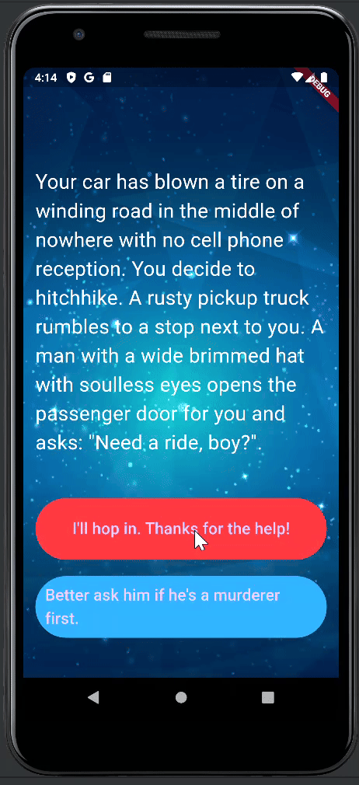

# Destini-Flutter

Welcome to Destini, Your Own Adventure Game! This project is inspired by the interactive movie Bandersnatch and is built using Dart and Flutter as part of the Udemy course [The Complete Flutter Development Bootcamp with Dart](https://www.udemy.com/course/flutter-bootcamp-with-dart/).

## Table of Contents

- [Description](#description)
- [Features](#features)
- [Demo](#demo)

## Description

The Destini-Flutter, Your Own Adventure Game is an interactive storytelling application where players make choices that influence the narrative's outcome. Built with Dart and Flutter, the game demonstrates the application of object-oriented programming principles to create a well-structured and maintainable codebase. The game offers multiple story paths and endings, providing a unique experience for each player.

## Features

- Interactive storytelling with multiple choices.
- Branching narratives that lead to different endings.
- Clean and organized code using Dart OOP principles.
- Simple and intuitive user interface.

## Demo

